# Petshop & Swag Labs Testes Automaticos

# Resumo

Testes de API que cobrem todos os endpoits da aplicação https://petstore.swagger.io e teste E2E do site https://www.saucedemo.com que realizam o fluxo de realização de login, adição de produtos ao carinho e finalização da compra, todo os 2 testes estão integrados em pipelines CI do git hub actions para rodar esses testes a cada commit ou pull do projeto

## Como Executar Localmente

### 1. Clonar o repositorio

```bash

git clone https://github.com/ylapiy/PetShop_Teste.git

```

### 2. Testes de API (Postman/Newman)

É necessário ter o **Node.js** instalado.

```bash
# Instalar o Newman
npm install -g newman

# Executar os teste de api
newman run Teste_API/Teste_API_PetStore.json -e Teste_API/Env_postman.json --reporters cli
```

### 3. Testes de Automação web (Python/Selenium)

É necessario ter **python** e **chrome** instalado

```bash

#instalar o selenium e webdriver
python -m pip install selenium
python -m pip install webdriver-manager

#rodar o script de teste webz
python .\Teste_E2E\scrap.py
```

## Tecnologias Utilizadas

### **Automação de API**

- **Postman**: ferramenta principal para desenvolver os teste de api do petstore
- **Newman**: Executor de testes do Postman via linha de comando (CLI)
- **Petstore Swagger API**: API pública utilizada como alvo dos testes

### **Automação Web**

- **Python 3.10** : linguagem usada nos teste web
- **Selenium WebDriver**: ferramenta usada para fazer a automação web
- **SauceDemo (Swag Labs)**: Site utilizado para os testes de E2E.

### **CI/CD**

- **GitHub Actions**: Pipelines automatizadas para execução dos testes a cada push ou pull request.

---

## Estrutura do Projeto

```text
/
├── .github/ -> pasta com os arquivos do CI/CD
│   ├── postman.yml
│   └── selenium.yml
│
├── .Teste_API/ -> pasta com os jsons dos testes de API
│   ├── Env_postman.json
│   ├── Teste_API_PetStore.json
│   └── grayeye.png
│
├── .Teste_E2E/ -> pasta com os jsons dos  scripst de automação web
│   ├── pagina.py
│   └── scrap.py
│
├── prints/ -> pasta com as prints de execução do readme
├── .gitignore
└── README.md
```

---

## Prinst de Execução

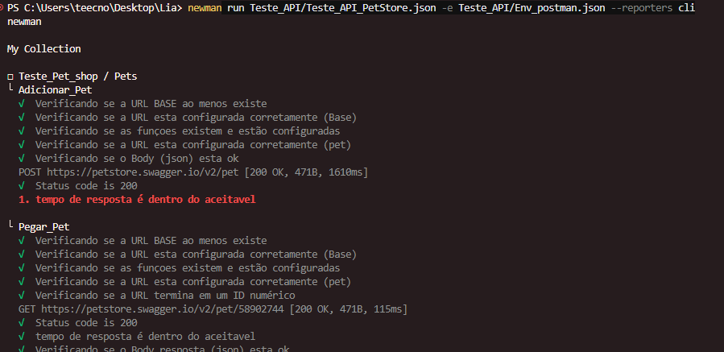
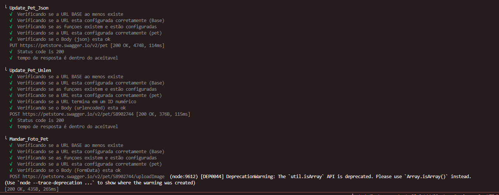
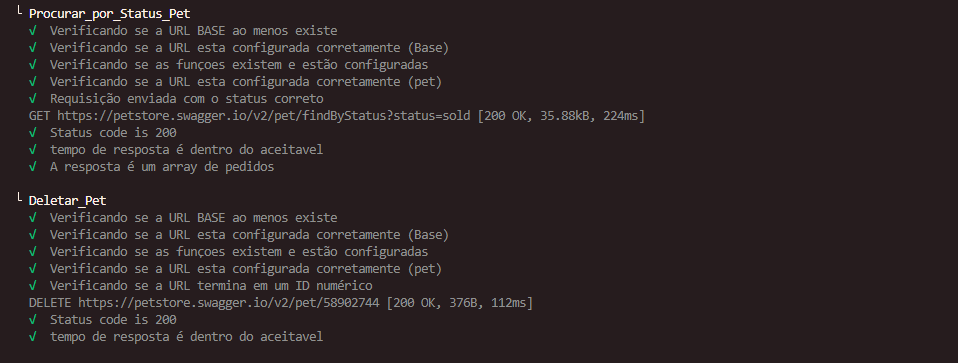
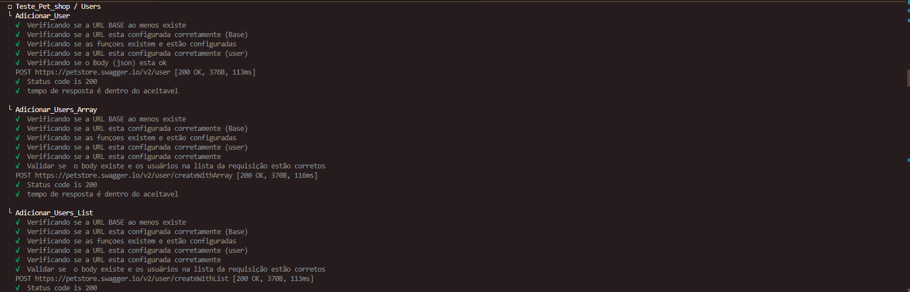
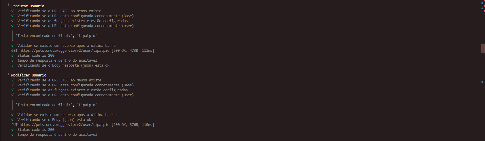
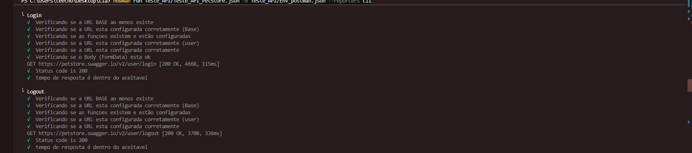
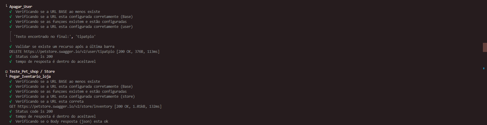
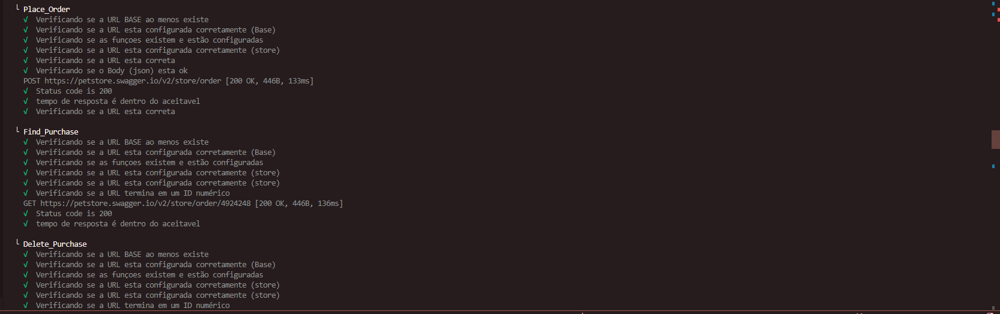
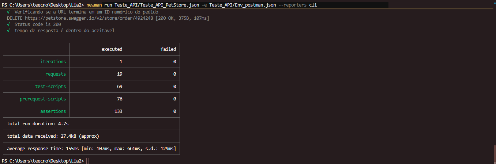
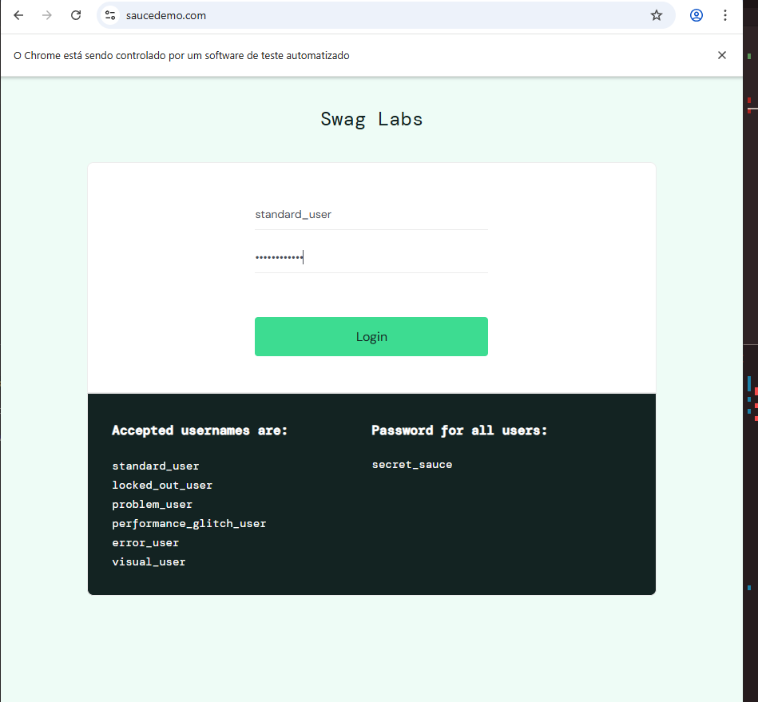
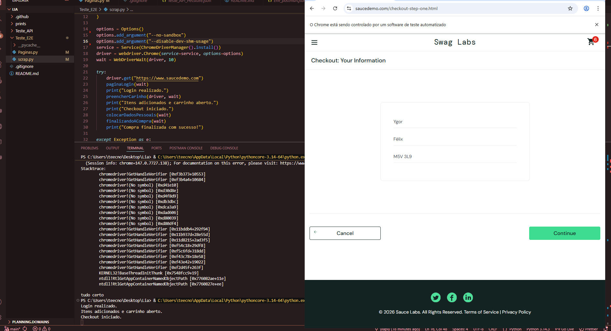
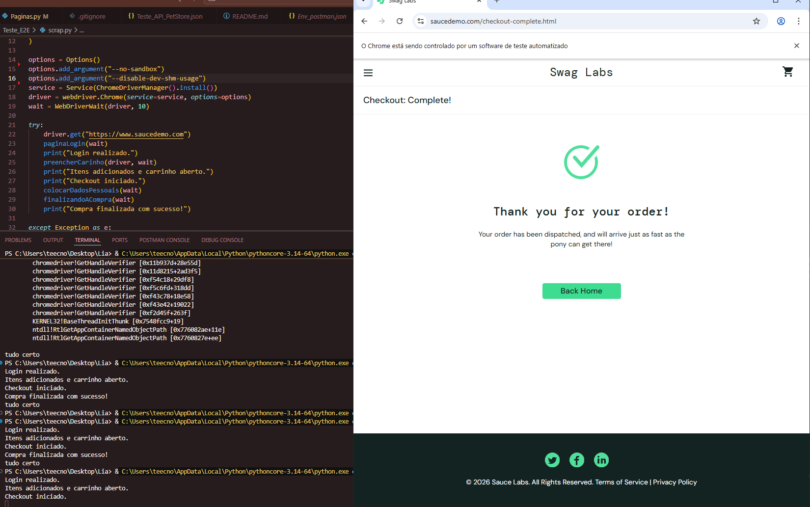
